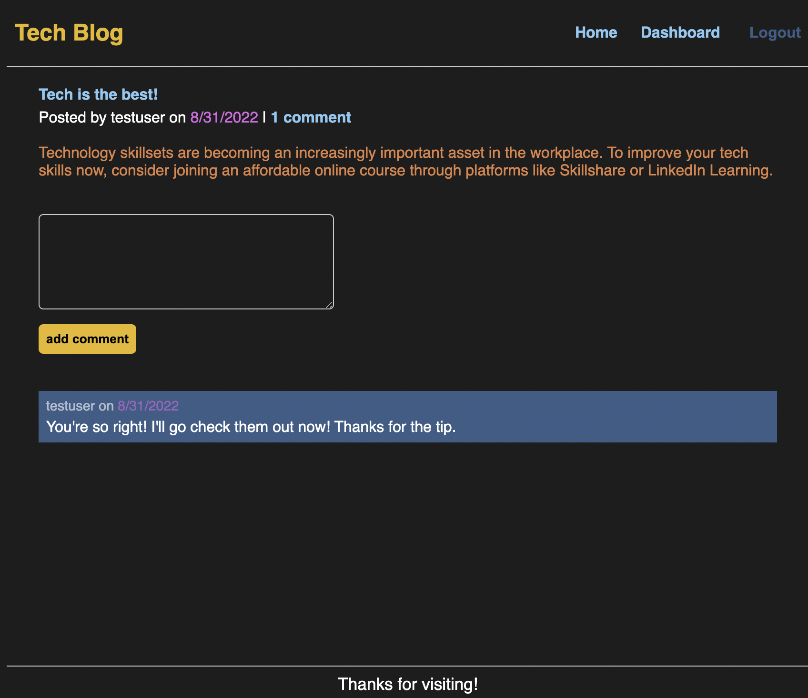

# Tech Blog

  ## Table of Contents
  1. [Description](#description)
  2. [Installation](#installation)
  3. [Usage](#usage)
  4. [License](#license)
  5. [Contributing](#contributing)
  6. [Questions](#questions)
   
## Description
- The motivation for creating this repository was to creat a site for users in the tech community to engage with eachother about relavant topics to the tech industry.
- This full stack application articulates with the database of this unqiue server to retain information contributed by users on the front end.
- While creating this application, I was to learn more about the ORM Sequelize, and continue to get comfortable with the express.js npm CRUD routes and server set up.
   
## Installation
To install the project repository, please follow these steps:
1. Clone my repository to your own on your local device.
2. Navigate into the repository root directory.
3. Enter ```npm install ``` into the command line to get access to all the necessary node modules.

## Usage
To get started using this Tech Blog...
1. Navigate to the deployed site: [https://radiant-mesa-21675.herokuapp.com/](https://radiant-mesa-21675.herokuapp.com/).
2. Sign up to contribute to the online space.



## License
This project is not licensed.

## Contributing
This project was created to meet guidelines provided by the University of Toronto School of Continuing Studies Coding Bootcamp. 

If you would like to contribute to this repository, please first discuss the change you wish to make via issue, email, or any other method with the owner of this repository before making a change. Only respectful engagement with this repository will be tolerated to foster an open and welcome environment.

  ### Pull Request Process
  - Pull requests will be merged upon approval of the repository owner.

## Questions
If you have any questions about this project repository, please feel free to contact its owner.
  #### GitHub: [katiebutler37](https://github.com/katiebutler37)
  #### Email: [katiebutler37@gmail.com](mailto:katiebutler37@gmail.com)

    
